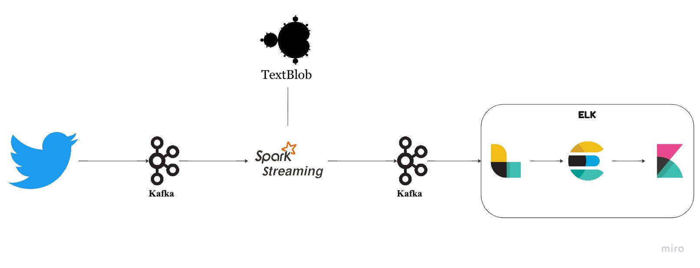

# Datos Streaming - Twitter

En este repositorio está descrito el procedimiento que hay que seguir para desplegar una solución para analisis de sentimientos de Tweets (Twitter)

# Orden

El siguiente es el orden sugerido para revisar los archivos `*.md` en este repositorio.
- **Dependencias:**
- **Kafka**
- **ElasticSearch**
- **Kibana**
- **Logstash**
- **Ejecución**

# Pasos para ejecución:
- **Dependencias**
	instalar:
	- Python 3.7*
	- Pyspark
	- Tweepy
	- Kafka libreria de python
	- TextBlob
- **Kafka**
	-	Revisar que el zookeeper y el servidor kafka estan en ejecución
	-	Revisar que esten creados los topic ***twitter*** y ***twitter-sa***
- **ElasticSearch y Kibana**
	- Comprobar que los servicios están funcionando bien y se tiene acceso al entorno grafico de Kibana
- **Logstash**
	- Lanzar el servicio (`$ bin/logstash`)
- **Ejecutar comando Pyspark**
	- ./.local/lib/python3.7/site-packages/pyspark/bin/spark-submit --packages org.apache.spark:spark-sql-kafka-0-10_2.12:3.1.1 --master local twitter_sentiment_analysis.py 
	- ***Si hay errores importante revisar versiones de Spark, Scala y spark-sql-kafka***
- **Ejecutar producer**
	- Ejecutar el archivo `producer.py`
- **Ver datos en Kibana**
	- En el simbolo "D" ir a `Manage spaces -> Data/Index Management`, ahí estará el indice que esta definido en el ETL `etl-twitter.conf` donde se cargan los datos enviados desde Logstash.
